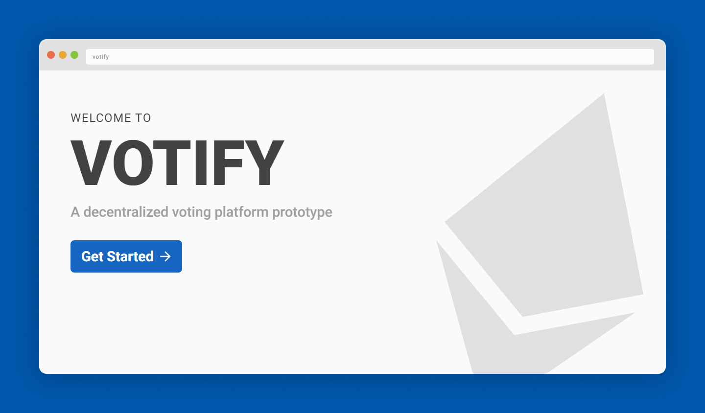

# Votify <a href="#-project-status"></a>

A POC of a decentralized voting platform with an emphasis on canadian provincial elections.

## Table of contents <!-- omit in toc -->

- [☀ Introduction](#-introduction)
- [🎯 Motivation](#-motivation)
  - [⛓ Create a complete blockchain (Web3) application](#-create-a-complete-blockchain-web3-application)
  - [🌐 Test out the new REMIX.RUN react web framework](#-test-out-the-new-remixrun-react-web-framework)
  - [🎨 Give another shot to MUI](#-give-another-shot-to-mui)
- [📷 Preview](#-preview)
- [💿 Setup](#-setup)
  - [Prerequisites](#prerequisites)
    - [Software](#software)
  - [Installation & Usage](#installation--usage)
      - [Configuring MetaMask to access the local blockchain](#configuring-metamask-to-access-the-local-blockchain)
- [🛠 Technologies Used](#-technologies-used)
- [🧪 Tests](#-tests)
- [🚦 Project Status](#-project-status)
- [✉ Contact](#-contact)
  - [Victor's socials](#victors-socials)
  - [Antoine's socials](#antoines-socials)

## ☀ Introduction

For my last university semester, I had to dedicate 18h/week to a project, just like my previous semester where I worked on [RunApp](https://github.com/vcheeney/RunApp).

This semester, I wanted to explore the world of crypto, but more on that later.

As I started planning out this idea, I quickly met [Antoine Gagnon](https://antoineg.dev/), a very smart peer that I somehow never crossed paths with during my whole university studies.

I could not have asked for a better partner.

This repository is the product of our labour.

In the end, we built the POC of a decentralized voting platform that runs on the Ethereum blockchain. This includes:

1. The development, testing and deployment of a ballot smart
2. The design and implementation of web3 DAPP that interacts with a smart contract (the web application used for voting and seeing the results)

## 🎯 Motivation

My goals for this project were to...

### ⛓ Create a complete blockchain (Web3) application

Blockchain and Web3 are rapidly growing in popularity thanks to cryptocurrencies, NFTs and other financial applications. Nonetheless, the properties of blockchain do have the potential to serve other purposes like verifiable voting, supply chain monitoring, identity verification, etc.

### 🌐 Test out the new REMIX.RUN react web framework

I'm a big fan of NextJS, but as responsible developers, it is always a good idea to stay aware of what other frameworks have to offer.

### 🎨 Give another shot to MUI

I used MUI in some old projects that never saw the light of day, but I was not a fan of the default Material Design styles. Therefore, when I discovered TailwindCSS, I quickly moved over. Recently, MUI received a [major update](https://mui.com/blog/material-ui-is-now-mui/) that highly improved the theme customization ability. I was desperate to try out!

## 📷 Preview

https://user-images.githubusercontent.com/23345182/154748711-9b833dc0-183e-4ad2-90c8-1ecb09eb2422.mp4

## 💿 Setup

### Prerequisites

#### Software

- Node v16 or above
- NPM
- Docker and docker-compose
- A web browser (Chrome for example) with [MetaMask](https://metamask.io/) installed

### Installation & Usage

First, clone the repository with the following command:

```sh
git clone git@github.com:vcheeney/voting-platform.git
```

Run everything with docker-compose:

```sH
docker-compose -f docker-compose.yml -f docker-compose.web.yml up
```

For development purposes, follow the more thorough [manual setup steps](SETUP.md).

##### Configuring MetaMask to access the local blockchain

In your web browser:

1. Open the MetaMask extension by clicking on its icon in the browser toolbar
2. Click on "Add Network"
3. Fill the requested fields with the following information:
   - **Network Name**: Hardhat
   - **New RPC URL**: http://127.0.0.1:8545/
   - **Chain ID**: 31337
   - **Currency Symbol**: _leave empty_
   - **Block Explorer URL**: _leave empty_
4. Click on "Save"

In the MetaMask extension:

1. Select the Hardhat network that you just configured
2. Import the first account from the list that appeared when you previously ran `npx hardhat node` in your other terminal (which should still be open)
3. **Optional:** Rename the account to _Chairperson_ or any other familiar name.

## 🛠 Technologies Used

- [Remix 1.1.1](https://remix.run/) - Full stack web framework
- [Ethers 5.5.3](https://docs.ethers.io/v5/) - JavaScript library to interact with smart contracts
- [MUI 5.3.0](https://mui.com/) - React components library
- [Prisma 3.8.1](docs_url) - TypeScript ORM
- [Hardhat 2.8.3](https://hardhat.org/) - Ethereum development environment
- [Solidity 0.8.12](https://docs.soliditylang.org/en/v0.8.12/) - EVM compatible smart contract development language
- [Typechain 5.2.0](https://github.com/dethcrypto/TypeChain) - Package to generate TS types for smart contracts
- [Mocha 9.1.0](https://mochajs.org/) - JavaScript test framework
- [Chai 4.3.6](https://www.chaijs.com/) - TDD assertion library
- [Waffle 3.4.0](https://getwaffle.io/) - Chai matchers for smart contracts

## 🧪 Tests

When developing smart contracts, it is very important to do proper testing so that no funds are lost in production. To run the tests, do the following:

```bash
# Move into the hardhat subdirectory
cd hardhat

# Run the tests
npx hardhat test
```

## 🚦 Project Status


This project is currently under development.

## ✉ Contact

### Victor's socials

[hello@victorc.dev](mailto:hello@victorc.dev)

[@vcheeney](https://github.com/vcheeney)

https://victorc.dev/

### Antoine's socials

[hello@antoineg.dev](mailto:hello@antoineg.dev)

[@antoinegag](https://github.com/antoinegag)

[@antoine_dev](https://twitter.com/antoineg_dev)

https://antoineg.dev/
